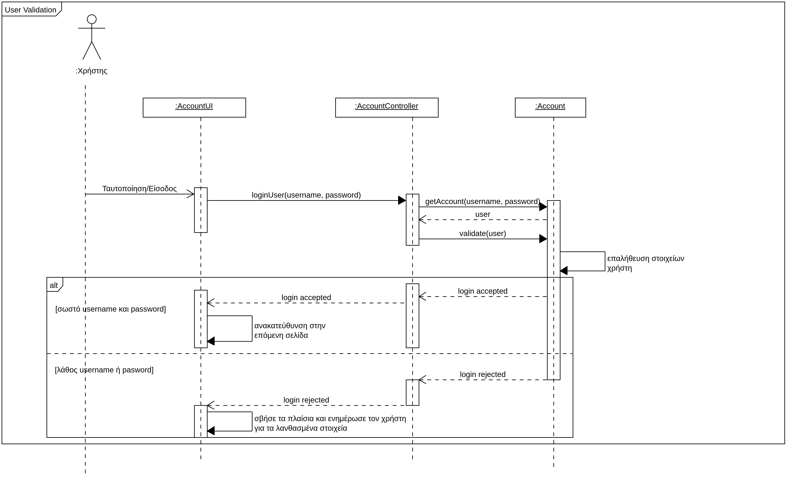

# Εισαγωγή

Στο παρόν έγγραφο αναλύεται το "Σύστημα υποστήριξης πανελλαδικών εξετάσεων". Πρόκειται για μια εφαρμογή στην πλατφόρμα του Android που χρησιμοποιείται από υποψηφίους των πανελλαδικών εξετάσεων, βαθμολογητές και σε όποιον ενδιαφέρεται να δει στατιστικά στοιχεία προηγούμενων ετών, καθώς και την βαθμολογία του (με εισαγωγή τυχαίων βαθμών).

Παρακάτω στο έγγραφο γίνεται αναφορά στις απαιτήσεις του λογισμικού και στην συνέχεια παρουσιάζεται ένα διάγραμμα περιπτώσεων χρήσης.

## Εμβέλεια

Το σύστημα υποστήριξης πανελλαδικών εξετάσεων θα παρέχει λειτουργικότητα για: 

* Την ασφαλή ταυτοποίηση του χρήστη μέσω κωδικών εισόδου.
* Τον υπολογισμό των μορίων των ενδιαφερόμενων χρηστών/υποψηφίων σε συγκεκριμένες βαθμολογίες στα εξεταζόμενα τους μαθήματα.
* Την σύγκριση των μορίων με τη βάση των προηγούμενων ετών για τις σχολές που τον ενδιαφέρουν.
* Τον υποψήφιο να διαλέξει τις σχολές που τον ενδιαφέρουν, με σειρά προτίμησης και να υποβάλει το μηχανογραφικό του.
* Τον βαθμολογητή να μπορεί να καταχωρεί στο σύστημα τις βαθμολογίες των γραπτών που βαθμολόγησε.
* Την εύκολη έκδοση των αποτελεσμάτων των εξετάσεων για κάθε υποψήφιο, καθώς και τις βάσεις εισαγωγής των τμημάτων.
* Την έκδοση στατιστικών στοιχείων για τις Πανελλαδικές εξετάσεις κάθε έτους.
* Τον διαχειριστή του συστήματος να μπορεί προσθέτει και να πραγματοποιεί αλλαγές στην λίστα των διαθέσιμων πανεπιστημίων κάθε χρόνο με την χρήση κάποιας εξωτερικής πηγής.

Το σύστημα υποστήριξης πανελλαδικών εξετάσεων δεν θα παρέχει λειτουργικότητα για:

* Την κατάσταση του μηχανογραφικού, δηλαδή αν βρίσκεται υπό εξέταση ή σε αναμονή.
* Την ενημέρωση του υποψηφίου για την ώρα υποβολής μηχανογραφικού.
* Την εξαγωγή του μηχανογραφικού σε άλλη μορφή αρχείου, για παράδειγμα PDF.
* Την αυτόματη σύνδεση με κάποια εξωτερική πλατφόρμα ενεργών και μη μαθητών. Το σύστημα δεν θα παρέχει κάποιον έλεγχο αν κάποιος είναι ενεργός μαθητής/υποψήφιος ή αν έχει ήδη αποφοιτήσει (και έχει συμμετέχει ήδη στην διαδικασία των εξετάσεων). Συνεπώς το σύστημα δεν είναι σε θέση να αντιλαμβάνεται την παρούσα κατάσταση του χρήστη, αντιλαμβάνεται τους πάντε ως ίδιους.

## Ορισμοί, ακρώνυμα και συντομογραφίες

| Έννοια | Επεξήγηση |
| ------ | -------- |
| ΑΕΙ    | Ανώτατο Εκπαιδευτικό Ίδρυμα
| ΕΒΕ    | Ελάχιστη Βάση Εισαγωγής
| Υποψήφιος| Κάθε πρόσωπο που λαμβάνει μέρος στην διαδικασία των Πανελλαδικών εξετάσεων και χρησιμοποιεί την εφαρμογή για να δει την βαθμολογία του και να υποβάλει το μηχανογραφικό του.
| Βαθμολογητής| Κάθε πρόσωπο που βαθμολογεί τα γραπτά των υποψηφίων και καταχωρεί την βαθμολογία τους στο σύστημα.
| Ενδιαφερόμενος | Κάθε πρόσωπο που θέλει να δει στατιστικά στοιχεία, τις βάσεις εισαγωγής προηγούμενων ετών.|
|Διαχειριστής | Κάθε πρόσωπο που έχει αναλάβει την εισαγωγή και έλεγχο των διαθέσιμων πανεπιστημίων/τμημάτων κάθε χρονιά από μια εξωτερική πηγή.

## Επισκόπηση
Στην συνέχεια του υπόλοιπο εγγράφου ακολουθεί μια συνολική περιγραφή του συστήματος. Αυτό θα γίνει φυσικά με αναλυτικές παραγράφους που εξετάζουν το σύνολο του συστήματος, με διαγράμματα και με πίνακες που θα αναλύουν περαιτέρω το σύστημα.

# Συνολική περιγραφή

## Επισκόπηση μοντέλου περιπτώσεων χρήσης

| Περίπτωση Χρήσης | Περιγραφή |
| --------------   | --------- |
| ΠΧ1. Ταυτοποίηση Χρήστη | Πριν την πραγματοποίηση ενεργειών από την πλευρά των χρηστών του συστήματος/εφαρμογής θα πρέπει να ταυτοποιηθούν απο το σύστημα με την χρήση username και password. |
| ΠΧ2. Εγγραφή υποψηφίου | Ο υποψήφιος θα πρέπει να εισάγει όλα τα απαραίτητα στοιχεία που του ζητούνται για να πραγματοποιήσει την εγγραφή του στο σύστημα των πανελλαδικών εξετάσεων. Τα στοιχεία θα περιλαμβάνουν το ονοματεπώνυμο του, την ημερομηνία γέννησης, αριθμό ταυτότητας, email, password και άλλα. |
| ΠΧ3. Υποβολή Μηχανογραφικού | Μετά την επιτυχή εγγραφή του υποψηφίου, μπορεί να επιλέξει τις σχολές που των ενδιαφέρουν και να προχωρήσει στην καταχώρηση του μηχανογραφικού του|
| ΠΧ4. Αναζήτηση Σχολών/Τμημάτων | Ο υποψήφιος και ο ενδιαφερόμενος θα μπορεί να αναζητήσει σχολές που τον ενδιαφέρουν και δει σχετικά στοιχεία με αυτές όπως την βάση εισαγωγής, απαιτούμενα μαθήματα και άλλα. |
| ΠΧ5. Εισαγωγή Σχολών/Τμημάτων | Ο διαχειριστής θα μπορεί να εισαγεί τις διαθέσιμες σχολές, καθώς και τα στοιχεία, στην εφαρμογή από μια εξωτερική υπηρεσία. |
| ΠΧ6 Εισαγωγή Μαθημάτων | Ο διαχειριστής θα μπορεί να εισάγει τα εξεταζόμενα μαθήματα του κάθε επιστημονικού πεδίου, ώστε στην συνέχεια να μπορούν να καταχωρηθούν οι βαθμολογίες του κάθε υποψηφίου από τον βαθμολογητή. |
| ΠΧ7. Υπολογισμός Μορίων | Η εφαρμογή, αφού έχει βαθμολογηθεί ο υποψήφιος, θα υπολογίζει, προβάλει τα μόρια και τα τμήματα σχολών που μπορεί να εισαχθεί. |
| ΠΧ8. Καταχώρηση Βαθμολογίας | Μέτα την επιτυχή ταυτοποίηση του βαθμολογητή, θα μπορεί να εισάγει τις βαθμολογίες των γραπτών που έχει βαθμολογήσει.|
| ΠΧ9. Προβολή Βάσεων Εισαγωγής | Ο κάθε ενδιαφερόμενος θα μπορεί με την βοήθεια της εφαρμογής να δει τις βάσεις εισαγωγής των σχολών, είτε για στατιστικούς λόγους είτε για προσωπικού ενδιαφέροντος είτε για οποιοδήποτε άλλο λόγο επιθυμεί. | |

## Υποθέσεις και εξαρτήσεις

\[*Γράφουμε τις υποθέσεις που κάνουμε και τις εξαρτήσεις του συστήματος σε σχέση με το περιβάλλον του.*\]

# Ειδικές Απαιτήσεις 

## Περιπτώσεις χρήσης

### Οι ενδιαφερόμενοι και οι ανάγκες τους

| Ενδιαφερόμενος | Ανάγκες |
| -------------  | ------- |
| Βαθμολογητής   | <ul><li>να μπορεί να ταυτοποιηθεί εύκολα και γρήγορα.</li><li>να μπορεί να επιλέγει έναν υποψήφιο από ένα σύνολο υποψηφίων.</li><li>να μπορεί να εισάγει την βαθμολογία του υποψηφίου στα αντίστοιχα εξεταζόμενα μαθήματα</li></ul>|
| Υποψήφιος      | <ul><li>να μπορεί να γραφτεί στο σύστημα εύκολα και γρήγορα, καθώς και να μπορεί να συνθεθεί μελλοντικά.</li><li>να μπορεί να δει τα συνολικά μόρια που έχει συγκεντρώσει από τις εξετάσεις και τα τμήματα που μπορεί να περάσει, με βάση αυτά.</li><li>να μπορεί να υποβάλει το μηχανογραφικό του με τις σχολές/τμήματα της προτίμησης του (έχοντας μια λίστα με όλα τα διαθέσιμα τμήματα).</li></ul>|
| Ενδιαφερόμενος | <ul><li>να μπορεί να δει τις βάσεις εισαγωγής των διαφόρων τμημάτων, για στατιστικούς ή απλού ενδιαφέροντος λόγους.</li></ul>|
| Διαχειριστής | <ul><li>θέλει να μπορεί να εισάγει από μια εξωτερική πλατφόρμα του υπουργείου τις σχολές/τμήματα.</li><li>θέλει να μπορεί να εισάγει τα εξεταζόμενα μαθήματα για κάθε επιστημονικό πεδίο.</li></ul>

### Actors του συστήματος

\[*Ένα πίνακας με του actors του συστήματος. Βλέπε πίνακας 3-7 παραδείγματος 3-11 στη σελίδα 167 του βιβλίου.*\]

| Actors | Περιγραφή | Στόχοι | Ενδιαφερόμενοι |
| ------ | --------- | ------ | ------------ |
| Βαθμολογητής | Είναι υπεύθυνος για την εισαγωγή βαθμών | Αναζήτηση υποψηφίου Εισαγωγή βαθμών υποψηφίου | Βαθμολογητής|
| Υποψήφιος | Οποιοσδήποτε συμμετέχει στις Πανελλαδικές εξετάσεις και είναι εγγεγραμένος σε αυτές μέσω της εφαρμογής | Εγγραφή υποψηφίου Υπολογισμός μορίων Υποβολή μηχανογραφικού δελτίου Αναζήτηση σχολών/τμημάτων | Υποψήφιος |
| Ενδιαφερόμενος | Οποιοσδήποτε θέλει να δει τις βάσεις εισαγωγής των διαφόρων τμημάτων για προσωπικούς ή/και στατιστικούς λόγους | Αναζήτηση βάσεων εισαγωγής ανά τμήμα | Ενδιαφερόμενος |
| Διαχειριστής | Αναλαμβάνει την εισαγωγή των τμημάτων και των εξεταζόμενων μαθημάτων. Ο διαχεριστής μπορεί να είναι ένας υπάλληλος του υπουργείου | Εισαγωγή σχολών/τμημάτων Εισαγωγή εξεταζόμενων μαθημάτων | 

### Περιγραφές περιπτώσεων χρήσης
Παρακάτω παραθέτουμε τις περιγραφές των περιπτώσεων χρήσεις του συστήματος μας.

#### [ΠΧ1 Ταυτοποίηση Χρήστη](uc1-user-identification.md)

#### [ΠΧ2 Εγγραφή Υποψηφίου](uc2-user-create-account.md)

#### [ΠΧ3 Υποβολή Μηχανογραφικού](uc3-submit-preferred-departments.md)

#### [ΠΧ4 Αναζήτηση Σχολών/Τμημάτων](uc4-search-departments.md)

#### [ΠΧ5 Εισαγωγή Σχολών/Τμημάτων](uc5-insert-departments.md)

#### [ΠΧ6 Εισαγωγή Μαθημάτων](uc6-insert-lessons.md)

#### [ΠΧ7 Υπολογισμός Μορίων](uc7-marks-calculation.md)

#### [ΠΧ8 Καταχώρηση Βαθμολογίας](uc8-enter-marks.md)

#### [ΠΧ9 Προβολή Βάσεων Εισαγωγής](uc9-view-stats.md)

 

## Συμπληρωματικές προδιαγραφές 

### Απαιτήσεις διεπαφών

#### Διεπαφές χρήστη
* Η διεπαφή χρήστη θα πρέπει να πληρεί τα Android Design Guidelines.
* Θα πρέπει να είναι απλή, εύχρηστη και φιλική προς τον χρήστη. Θα έχει όλα τα απαραίτητα πλαίσια και κουμπιά (αναλυτικά) ώστε ο χρήστης να ξέρει πως να ενεργήσει σε κάθε περίπτωση.
* Σε κάθε σελίδα θα υπάρχει σύνδεσμος βοήθειας, με σχετικές πληροφορίες για την κάθε λειτουργία.

#### Διεπαφές υλικού
* Ο χρήστης θα πρέπει να διαθέτει κινητό τηλέφωνο με το λειτουργικό σύστημα Android.

#### Διεπαφές επικοινωνίας
* Το σύστημα θα ενημερώνει τον υποψήφιο με την χρήση ειδοποιήσεων για την επιτυχή διενέργεια μιας εργασίας, όπως για παράδειγμα για την επιτυχή αποθήκευση του μηχανογραφικού.

#### Διεπαφές λογισμικού
* Για την αποστολή των ειδοποιήσεων, το σύστημα θα κοιτάει για την κατάσταση των διαφόρων διεργασίων και με την χρήση αυτών σε συνδιασμό με κατάλληλες βιβλιοθήκες του Android, θα αποστέλνει τις ειδοποιήσεις.

### Περιορισμοί σχεδίασης και υλοποίησης
* Το σύστημα θα πρέπει να υποστηρίζει την επικοινωνία με τα σχεσιακά συστήματα διαχείρισης βάσεων δεδομένων PostgreSQL.
* Το σύστημα θα αναπτυχθεί σε Java και με την χρήση Gradle.
* Tο σύστημα θα εκτελείται σε εικονικές μηχανές της Java από την έκδοση 8 ή νεότερη. Επίσης θα τρέχει από την έκδοση 10 του Android ή νεότερη.

### Ποιοτικά χαρακτηριστικά

#### Απόδοση
* Το σύστημα θα πρέπει να υποστηρίζει τουλάχιστον 50000 ταυτόχρονους χρήστες (όσο είναι περίπου ο αριθμός των υποψηφίων ανά έτος, δεδομένου ότι υπάρχουν στιγμές όπου οι περισσότεροι χρησιμοποιούν το σύστημα ταυτόχρονα).
* Ο υπολογισμός των βάσεων εισαγωγής και των εισακτέων σε κάθε σχολή θα πρέπει να είναι άμεσος (το πολύ μερικές ώρες από τη λήξη της προθεσμίας υποβολής μηχανογραφικού).

#### Διαθεσιμότητα
* Οι λειτουργίες αναζήτησης σχολών, προβολής βάσεων, στατιστικών και υπολογισμός μορίων, θα πρέπει να είναι διαθέσιμες 24/7.
* Τυχόν έλλειψη διαθεσιμότητας των υπόλοιπων λειτουργιών θα πρέπει να μην βρίσκεται εντός του χρονικού διαστήματος Μαΐου-Σεπτεμβρίου.

#### Ασφάλεια
* Οι λειτουργίες υποβολής μηχανογραφικού και καταχώρησης βαθμολογιών θα πραγματοποιούνται με διαδικασία αυθεντικοποίησης.
* Οι λειτουργίες αναζήτησης σχολών, προβολής βάσεων και στατιστικών θα είναι διαθέσιμες μέσω της εφαρμογής για κάθε ενδιαφερόμενο.

#### Ευελιξία
* Ενδεχόμενη αρχιτεκτονική αλλαγή του συστήματος θα πρέπει να μην βρίσκεται εντός του χρονικού διαστήματος Μαΐου-Σεπτεμβρίου.

#### Ευχρηστία
* Ο χρήστης του συστήματος θα πρέπει να μπορεί να χρησιμοποιεί το σύστημα σχεδόν άμεσα χωρίς προηγουμένως να έχει λάβει μέρος σε κάποια ειδική εκπαίδευση.
* Η μόνη προϋπόθεση για τον τελικό χρήστη είναι να γνωρίζει πως να χρησιμοποιεί ένα κινητό τηλέφωνο με λειτουργικό σύστημα Android.

# Υποστηρικτικό υλικό

## Μοντέλο πεδίου

## Ανάλυση περιπτώσεων χρήσης
--------------------------

### Συμπεριφορές

#### Ταυτοποίηση Χρήστη

#### Εισαγώγη Βαθμών (από βαθμολογητή)

### Ο Υποψήφιος

