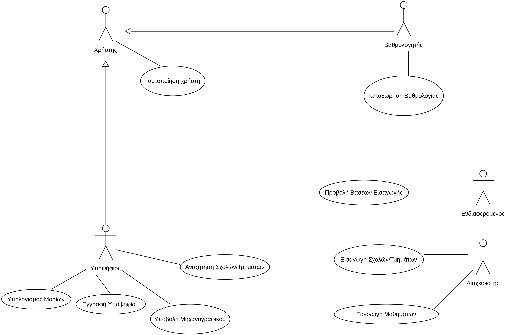

# Εισαγωγή

Στο παρόν έγγραφο αναλύεται το "Σύστημα υποστήριξης πανελλαδικών εξετάσεων". Πρόκειται για μια εφαρμογή που χρησιμοποιείται από υποψηφίους, βαθμολογητές και σε όποιον ενδιαφέρεται να δει στατιστικά στοιχεία.
Παρακάτω στο έγγραφο γίνεται αναφορά στις απαιτήσεις του λογισμικού καθώς παρουσιάζεται ένα διάγραμμα περιπτώσεων χρήσης.

## Εμβέλεια

Η εφαρμογή θα μπορεί να πραγματοποιεί τις εξής λειτουργίες: 

* Θα μπορεί να υπολογίζει τα μόρια των ενδιαφερόμενων χρηστών/υποψηφίων σε συγκεκριμένες βαθμολογίες στα εξεταζόμενα μαθήματα καθώς και να συγκρίνει με τη βάση των προηγούμενων ετών για τις σχολές που τον ενδιαφέρουν.
* Θα μπορεί ο υποψήφιος να διαλέξει τις σχολές που τον ενδιαφέρουν, με την σειρά προτίμησης και να υποβάλει το μηχανογραφικό του.
* Ο βαθμολογητής θα μπορεί να καταχωρεί στο σύστημα τις βαθμολογίες των γραπτών που βαθμολόγησε.
* Θα γίνεται εύκολη έκδοση των αποτελεσμάτων καθώς το σύστημα θα βγάζει τα αποτελέσματα των εξετάσεων για κάθε υποψήφιο, καθώς και τις βάσεις εισαγωγής των τμημάτων.
* Θα μπορεί να εκδίδει στατιστικά στοιχεία για τις Πανελλαδικές εξετάσεις κάθε έτους.
* Θα επιτρέπει στον διαχειριστή του συστήματος να προσθέτει και να πραγματοποιεί αλλαγές στην λίστα των διαθέσιμων πανεπιστημίων κάθε χρόνο με την χρήση κάποιας εξωτερικής πηγής.

Η εφαρμογή δεν θα πραγματοποιεί τις εξής λειτουργίες:

## Ορισμοί, ακρώνυμα και συντομογραφίες

* ΑΕΙ: Ανώτατο Εκπαιδευτικό Ίδρυμα
* ΕΒΕ: Ελάχιστη Βάση Εισαγωγής

## Επισκόπηση

# Συνολική περιγραφή

## Επισκόπηση μοντέλου περιπτώσεων χρήσης

* Ταυτοποίηση Χρήστη: Πριν την πραγματοποίηση ενεργειών από την πλευρά των χρηστών του συστήματος/εφαρμογής θα πρέπει να ταυτοποιηθούν απο το σύστημα με την χρήση username και password.
* Εγγραφή υποψηφίου: Ο υποψήφιος θα πρέπει να εισάγει όλα τα απαραίτητα στοιχεία που του ζητούνται για να πραγματοποιήσει την εγγραφή του στο σύστημα των πανελλαδικών εξετάσεων. Τα στοιχεία θα περιλαμβάνουν το ονοματεπώνυμο του, την ημερομηνία γέννησης, αριθμό ταυτότητας, email και password.
* Υποβολή Μηχανογραφικού: Μετά την επιτυχή εγγραφή του υποψηφίου, μπορεί να επιλέξει τις σχολές που των ενδιαφέρουν και να προχωρήσει στην καταχώρηση του μηχανογραφικού του.
* Προβολή Μηχανογραφικού: Έπειτα την επιτυχή εγγραφή και υποβολή του μηχανογραφικού, ο υποψήφιος μπορεί να προβάλει το μηχανογραφικό του.
* Αναζήτηση Σχολών/Τμημάτων: Ο υποψήφιος και ο ενδιαφερόμενος θα μπορεί να αναζητήσει σχολές που τον ενδιαφέρουν και δει σχετικά στοιχεία με αυτές όπως την βάση εισαγωγής, απαιτούμενα μαθήματα και άλλα.
* Εισαγωγή Σχολών/Τμημάτων: Ο διαχειριστής θα μπορεί να εισαγεί τις διαθέσιμες σχολές, καθώς και τα στοιχεία, στην εφαρμογή από μια εξωτερική υπηρεσία.
* Επεξεργασία Στοιχείων Τμημάτων: Ο διαχειριστής θα μπορεί, μετά την εισαγωγή των τμημάτων στην εφαρμογή, να επεξεργάζεται τα στοιχεία των σχολών και των εκάστοτε τμημάτων.
* Υπολογισμός Μορίων: Ο ενδιαφερόμενος θα μπορεί να εισαγεί βαθμολογίες και θα του προβάλονται τα μόρια και τα τμήματα σχολών που μπορεί να εισαχθεί.
* Καταχώρηση Βαθμολογίας: Μέτα την επιτυχή ταυτοποίηση του βαθμολογητή, θα μπορεί να εισάγει τις βαθμολογίες των γραπτών που έχει βαθμολογήσει.