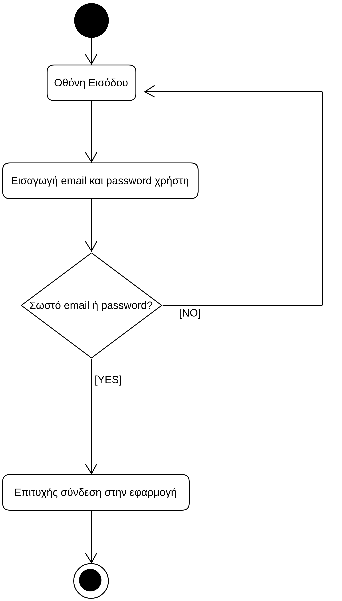

# ΠΧ1. Ταυτοποίηση Χρήστη

**Πρωτεύων Actor**: Χρήστης  
**Ενδιαφερόμενοι**  
**Υποψήφιος**: Θέλει να συνδεθεί στην εφαρμογή με χρήση των στοιχείων εισόδου του, ώστε να προχωρήσει στην καταχώρηση μηχανογραφικού δελτίου. 
**Βαθμολογήτης**: Θέλει να συνδεθεί στην εφαρμογή με χρήση των στοιχείων εισόδου του, ωστε να καταχωρήσει την βαθμολογία στα μαθήματα των υποψηφίων.

## Βασική Ροή
1. Η εφαρμογή ζητάει από τον χρήστη να εισάγει το email και το password.
2. Ο χρήστης εισαγεί στην εφαρμογή το email και το password, που έχει δηλώσει κατά την εγγραφή του. 
3. Το σύστημα επαληθεύει το email και password, και συνδέει τον χρήστη.

**Εναλλακτικές Ροές**

*3α. Ο χρήστης δεν εισήγαγε σωστό email (δηλαδή δεν υπάρχει αυτό το email σε κάποιον υπάρχον λογαριασμό ή δεν έχει βάλει το χαρακτήρα "@") ή password (δηλαδή δεν υπάρχει αυτό το password 
σε κάποιον υπάρχον λογαριασμό ή είναι μικρότερο των επτά χαρακτήρων και χωρίς ειδικούς χαρακτήρες) ή αφήνει κάποιο (ή και τα δύο) πλαίσια κενά.*
1. Το σύστημα εμφανίζει μήνυμα σφάλματος.
2. Η ΠΧ επιστρέφει στο βήμα 1 της βασικής ροής.

## Διαγράμματα 
### Διάγραμμα Δραστηριότητας- Ταυτοποίηση Χρήστη

