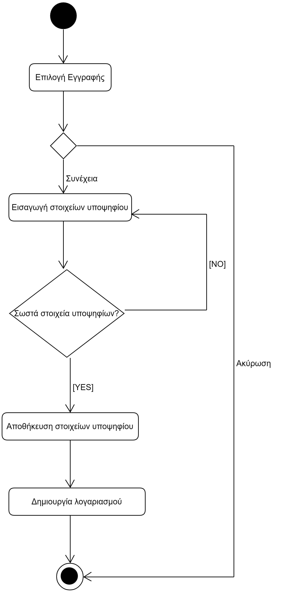

# ΠΧ2. Εγγραφή Υποψηφίου

**Πρωτεύων Actor**: Υποψήφιος 
**Ενδιαφερόμενοι**
**Υποψήφιος**: Θέλει να δημιουργήσει λογαριασμό στην εφαρμογή με τα προσωπικά του στοιχεία, ώστε να προχωρήσει στην καταχώρηση μηχανογραφικού δελτίου.

## Βασική Ροή
1. Ο υποψήφιος επιλέγει την επιλογή εγγραφής.
2. Η εφαρμογή ζητάει από τον υποψήφιο να εισάγει το ονοματεπώνυμο του, τον αριθμό ταυτότητας, την ημερομηνία γέννησης του, το email και το password.
3. Ο υποψήφιος εισάγει τα παραπάνω στοιχεία.
4. Τα στοιχεία εγγραφής του αποθηκεύονται στο σύστημα και δημιουργεί τον λογαριασμό.

**Εναλλακτικές Ροές**

*3α. Ο χρήστης επιλέγει "Ακύρωση".*
1. Το σύστημα επιστρέφει τον χρήστη στην αρχική σελίδα.

*4α. Ο χρήστης αφήνει κενό πεδίο ή εισάγει λανθασμένα στοιχεία (πχ μικρό μήκος password)*
1. Το σύστημα εμφανίζει μήνυμα σφάλματος.
2. Η ΠΧ επιστρέφει στο βήμα 2 της βασικής ροής.

## Διαγράμματα 
### Διάγραμμα Δραστηριότητας- Εγγραφή Υποψηφίου

