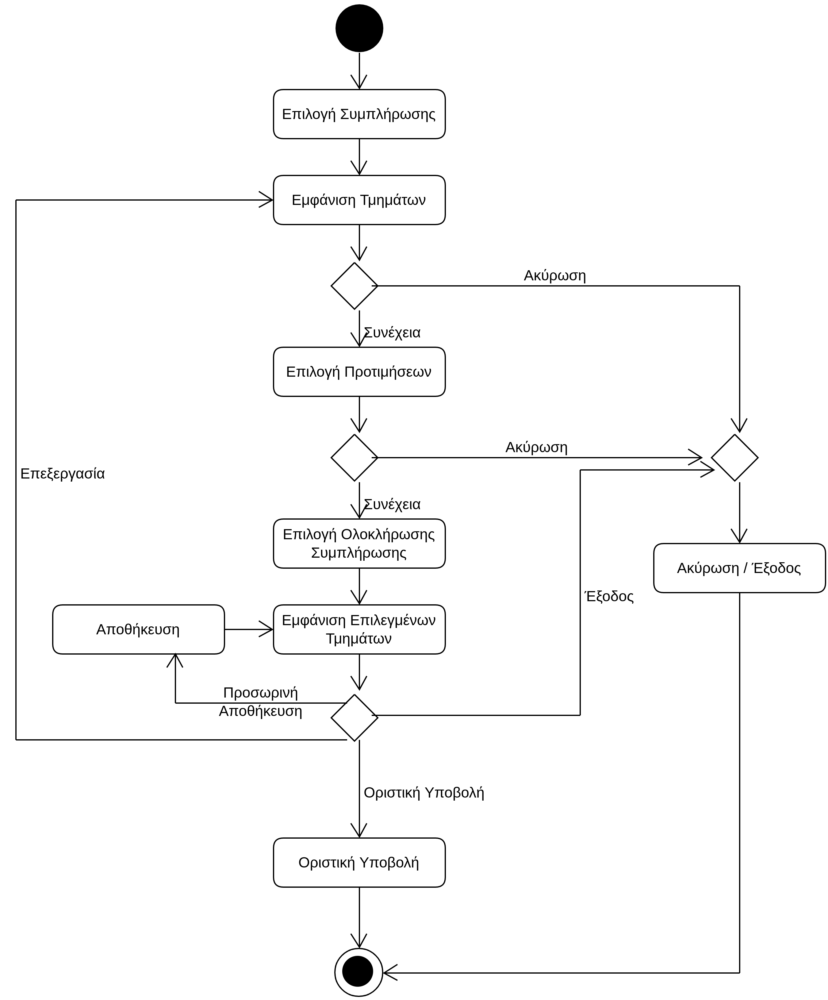

# ΠΧ3. Υποβολή Μηχανογραφικού

**Πρωτεύων Actor**: Υποψήφιος  
**Ενδιαφερόμενοι**  
**Υποψήφιος**: Θέλει να υποβάλει το μηχανογραφικό του δελτίο, δηλαδή να επιλέξει τις σχολές που θέλει να εισαχθεί, με σειρά προτεραιότητας. 
**Προϋποθέσεις**: Ο Υποψήφιος έχει εκτελέσει με επιτυχία την περίπτωση χρήσης “Ταυτοποίηση Χρήστη”.

## Βασική Ροή
1. Ο υποψήφιος επιλέγει "Συμπλήρωση μηχανογραφικού".
2. Η εφαρμογή εμφανίζει στον υποψήφιο τα τμήματα που αντιστοιχούν στο επιστημονικό πεδίο στο οποίο εξετάστηκε.
3. Ο υποψήφιος διαλέγει τη σειρά προτίμησης των διαθέσιμων τμημάτων, βάζοντας αύξοντα αριθμό προτεραιότητας δίπλα από τα τμήματα που επιθυμεί.
4. Ο υποψήφιος επιλέγει "Ολοκλήρωση συμπλήρωσης μηχανογραφικού".
5. Η εφαρμογή εμφανίζει τα τμήματα που επέλεξε ο υποψήφιος, με σειρά προτίμησης.
6. Ο υποψήφιος επιλέγει "Οριστική υποβολή".
7. Το μηχανογραφικό υποβάλλεται οριστικά στο σύστημα, δηλαδή δεν υπάρχει δυνατότητα επεξεργασίας.

**Εναλλακτικές Ροές**

*3α. Ο υποψήφιος επιλέγει "Ακύρωση".*
1. Η ΠΧ τερματίζει.

*4α. Ο υποψήφιος επιλέγει "Ακύρωση".*
1. Η ΠΧ τερματίζει.

*6α. Ο υποψήφιος επιλέγει "Έξοδος".*
1. Η ΠΧ τερματίζει.

*6β. Ο υποψήφιος επιλέγει "Προσωρινή Αποθήκευση".*
1. Το μηχανογραφικό αποθηκεύεται προσωρινά (δεν υποβάλλεται οριστικά).
2. Η ΠΧ επιστρέφει στο βήμα 5 της βασικής ροής.

*6β. Ο υποψήφιος επιλέγει "Επεξεργασία".*
1. Η ΠΧ επιστρέφει στο βήμα 2 της βασικής ροής.

## Διαγράμματα 
### Διάγραμμα Δραστηριότητας - Υποβολή Μηχανογραφικού

