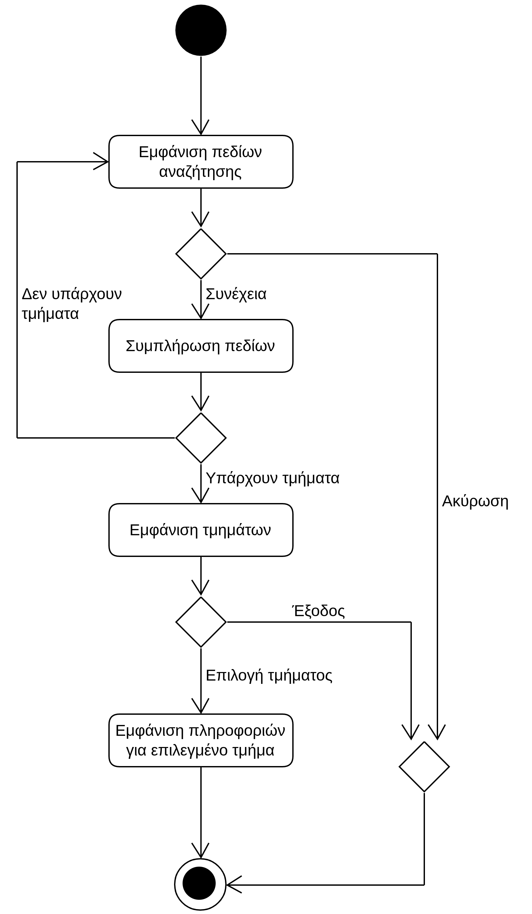

# ΠΧ4. Αναζήτηση Σχολών/Τμημάτων

**Πρωτεύων Actor**: Υποψήφιος  
**Ενδιαφερόμενοι**  
**Υποψήφιος**: Θέλει να αναζητήσει σχολές/τμήματα που τον ενδιαφέρουν και να δει πληροφορίες για αυτά.
**Προϋποθέσεις**: Ο υποψήφιος έχει εκτελέσει με επιτυχία την περίπτωση χρήσης “Ταυτοποίηση Χρήστη”. Επίσης έχουν εκτελεστεί επιτυχώς οι περίπτωσεις χρήσης "Εισαγωγή Σχολών/Τμημάτων" και "Εισαγωγή Μαθημάτων".

## Βασική Ροή
1. Η εφαρμογή εμφανίζει τα πεδία αναζήτησης (αναζήτηση ονόματος τμήματος, εμφάνιση τμημάτων σε συγκεκριμένες πόλεις, κλπ).
2. Ο υποψήφιος συμπληρώνει τα πεδία που επιθυμεί.
3. Η εφαρμογή εμφανίζει τα τμήματα που συμφωνούν με τα κριτήρια αναζήτησης.
4. Ο υποψήφιος επιλέγει ένα τμήμα.
5. Η εφαρμογή εμφανίζει πληροφορίες για το επιλεγμένο τμήμα.

**Εναλλακτικές Ροές**

*2α. Ο υποψήφιος επιλέγει "Ακύρωση".*
1. Η ΠΧ τερματίζει.

*3α. Δεν υπάρχουν τμήματα που να συμφωνούν με τα κριτήρια αναζήτησης.*
1. Το σύστημα εμφανίζει μήνυμα σφάλματος.
2. Η ΠΧ επιστρέφει στο βήμα 1 της βασικής ροής.

*4α. Ο υποψήφιος επιλέγει "Έξοδος".*
1. Η ΠΧ τερματίζει.

## Διαγράμματα 
### Διάγραμμα Δραστηριότητας - Αναζήτηση Σχολών/Τμημάτων

