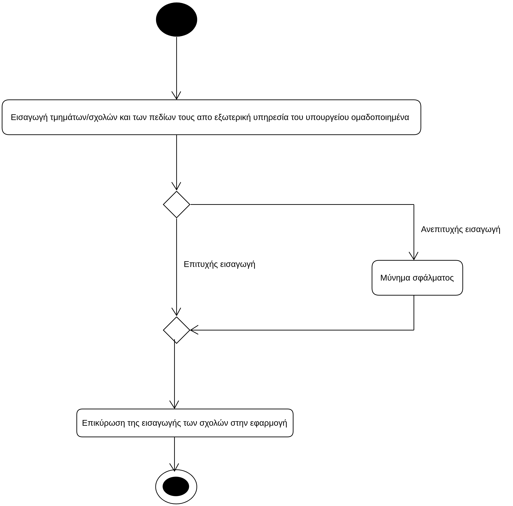

# ΠΧ5. Εισαγωγή Σχολών/Τμημάτων

**Πρωτεύων Actor**: Διαχειριστής  
**Ενδιαφερόμενοι**
**Διαχειριστής**: λαμβάνει τις σχολές και τα στοιχεία τους απο μια εξωτερική υπηρεσία και τα καταχωρεί στην εφαρμογή. 
**Υποφήφιος**: θέλει να ελέγχει ποίες σχολές είναι διαθέσιμες αυτή την χρονιά ανά επιστημονικό πεδίο καθώς και τα αντίστοιχα στοιχεία τους.

## Βασική Ροή
1. Ο Διαχειριστής πέρνει τις σχολές και τα υπόλοιπα στοιχεία για κάθε σχολή (όπως κωδικός τμήματος,πανεπιστημιακό ίδρυμα,Ελάχιστη βάση εισαγωγής κλπ) απο εξωτερική υπηρεσία του υπουργείου (ομαδοποιημένα).
2. Ο Διαχειριστής επικυρώνει την καταχώρηση των σχολών στην εφαρμογή.

**Εναλλακτικές ροές**  
*2α. Σφάλμα κατά την εισαγωγή τμημάτων/σχολών*
1. Το σύστημα βγάζει μύνημα σφάλματος και τερματίζει η περίπτωση χρήσης

## Διαγράμματα
### Διαγράμματα Δραστηριότητας- Εισαγωγή τμημάτων/Σχολών 

