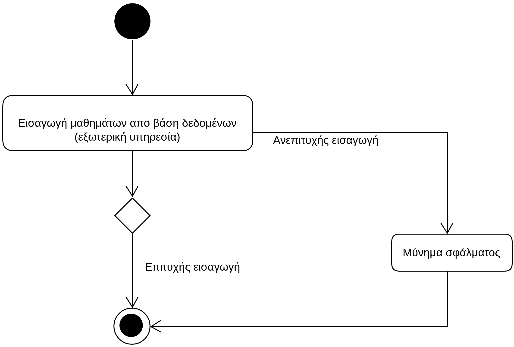

# ΠΧ6. Εισαγωγή μαθημάτων

**Πρωτεύων Actor**: Διαχειριστής συστήματος   
**Ενδιαφερόμενοι**  
**Βαθμολογητής**: Θέλει να υπάρχουν διαθέσιμα τα μαθήματα για να μπορεί να καταχωρήσει τις βαθμολογίες, έχοντας πρώτα κάνει login.

## Βασική ροή
1. Ο διαχειρηστής πέρνει τα μαθήματα απο την βάση.
2. Ο διαχειριστής εισάγει τα μαθήματα των πανελλαδικών εξετάσεων στο σύστημα για κάθε εξετάζομενο ανά επιστημονικό πεδίο.Όλα αυτα τα δεδομένα βρίσκονται
   σε μια βάση δεδομένων όπως και οι σχολές, απο την οποία και τα πέρνουμε.

**Εναλλακτικές ροές**  
*1α. Σφάλμα κατά την εισαγωγή των μαθημάτων*
1. Το σύστημα εμφανίζει μύνημα σφάλματος και τερματίζεται η διαδικασία καταχώρησης των μαθημάτων στην εφαρμογή.

## Διαγράμματα
### Διαγράμματα Δραστηριότητας - Εισαγωγή μαθημάτων

