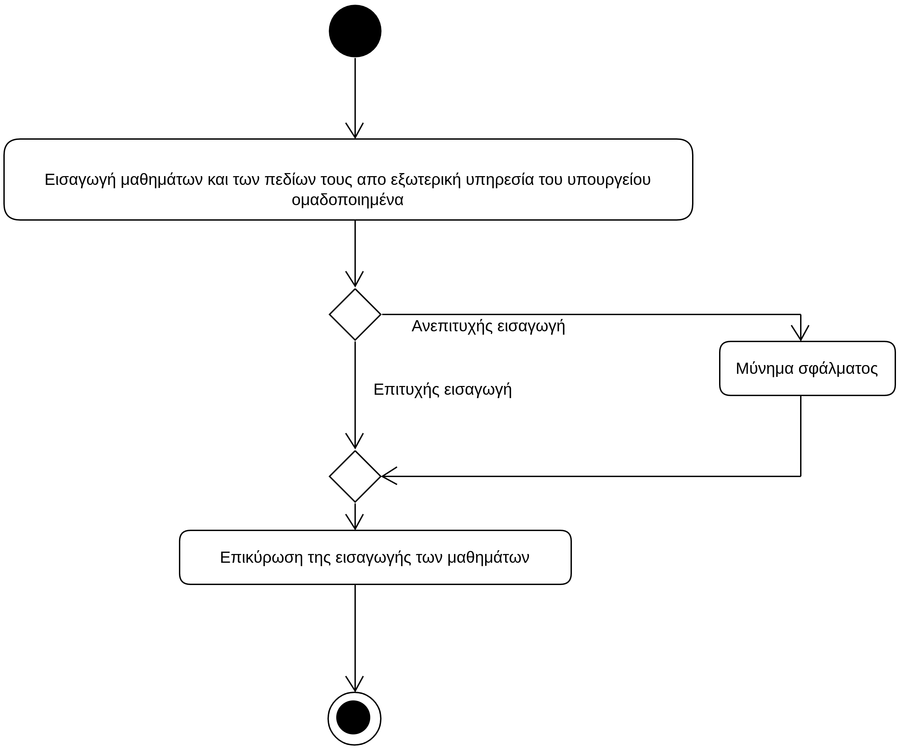

# ΠΧ6. Εισαγωγή μαθημάτων

**Πρωτεύων Actor**: Διαχειριστής συστήματος   
**Ενδιαφερόμενοι**  
**Βαθμολογητής**: Θέλει να υπάρχουν διαθέσιμα τα μαθήματα για να μπορεί να καταχωρήσει τις βαθμολογίες, έχοντας πρώτα κάνει login.

## Βασική ροή
1. Ο διαχειρηστής εισάγει τα μαθήματα και τα πεδία τους όπως συντελεστή βαρύτητας και το επιστημονικό πεδίο (ομαδοποιημένα) απο μια εξωτερική υπηρεσία του υπουργείου.
2. Ο διαχειριστής επικυρώνει την εισαγωγή των μαθημάτων στην εφαρμογή.

**Εναλλακτικές ροές**  
*2α. Σφάλμα κατά την εισαγωγή των μαθημάτων*
1. Το σύστημα εμφανίζει μύνημα σφάλματος και τερματίζεται η διαδικασία καταχώρησης των μαθημάτων στην εφαρμογή.

## Διαγράμματα
### Διαγράμματα Δραστηριότητας - Εισαγωγή μαθημάτων

