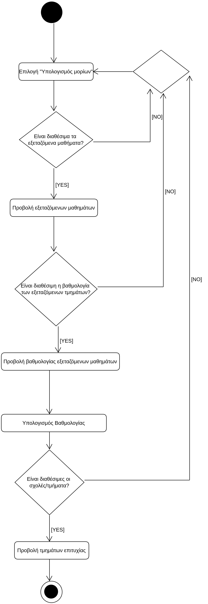

# ΠΧ7. Υπολογισμός Μορίων

**Πρωτεύων Actor**: Υποψήφιος  
**Ενδιαφερόμενοι**
**Υποψήφιος**: Θέλει εύκολα και γρήγορα να γίνεται ο υπολογισμός των μορίων του, ανάλογα την βαθμολογία του στις εξετάσεις και το επιστημονικό πεδίο του. Επίσης θέλει να προβάλονται οι σχολές/τμήματα που μπορεί να εισαχθεί (με βάση πάντα τα μόρια του).
**Προϋποθέσεις**: Ο Υποψήφιος έχει εκτελέσει με επιτυχία την περίπτωση χρήσης “Ταυτοποίηση Χρήστη”. Επιπλέον έχει ολοκληρωθεί επιτυχώς η περίπτωση χρήσης "Καταχώρηση Βαθμολογίας" από τον βαθμολογητή, καθώς και οι περίπτωσεις χρήσης "Εισαγωγή Σχολών/Τμημάτων" και "Εισαγωγή Μαθημάτων".

## Βασική Ροή
1. Ο υποψήφιος επιλέγει το πλαίσιο "Υπολογισμών Μορίων" από την εφαρμογή και μεταβαίνει στην αντίστοιχη σελίδα.
2. Ο υποψήφιος βλέπει στην σελίδα αυτή τα εξεταζόμενα μαθήματα και την αντίστοιχη βαθμολογία του σε αυτά.
3. Άμεσα η εφαρμογή υπολογίζει τα μόρια με βάση την βαθμολογία, τα μαθήματα, τους συντελεστές βαρύτητας και άλλους συντελεστές.
4. Η εφαρμογή θα προβάλει όλες τις σχολές/τμήματα που ο υποψήφιος, ανάλογα με την βαθμολογία του, μπορεί να περάσει.

## Εναλλακτικές Ροές

*2α. Ο υποψήφιος μπορεί να ακυρώσει την μετάβαση του στην σελίδα (πχ γιατί άλλαξε γνώμη για την ενέργεια που θέλει να κάνει).*
*2β. Η βαθμολογία του υποψηφίου ή/και τα εξεταζόμενα μαθήματα μπορεί να μην έχει περαστεί ακόμα στο σύστημα, οπότε δεν θα εμφανίζεται και προφανώς δεν θα μπορούν να υπολογιστούν τα μόρια του.*
*3α. Η σχολές/τμήματα μπορέι να μην έχουν περαστεί ακόμα στο σύστημα, επομένως ο υποψήφιος δεν θα μπορεί να δει σε ποια τμήματα έχει την δυνατόητα να εισαχθεί.*

## Διαγράμματα 
### Διάγραμμα Δραστηριότητας- Υπολογισμός Μοριών

