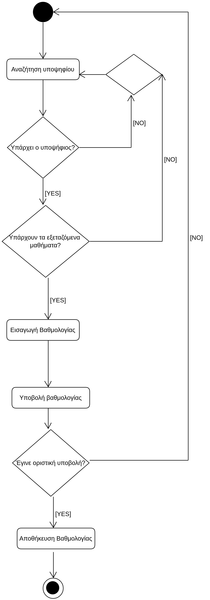

# ΠΧ8. Καταχώρηση Βαθμολογίας

**Πρωτεύων Actor**: Βαθμολογητής 
**Ενδιαφερόμενοι** 
**Βαθμολογητής**: Θέλει εύκολα και γρήγορα να καταχωρεί τις βαθμολογίες για όλους του υποψηφίους σε όλα τα εξεταζόμενα μαθήματα. 
**Προϋποθέσεις**: Ο Βαθμολογητής έχει εκτελέσει με επιτυχία την περίπτωση χρήσης “Ταυτοποίηση Χρήστη”. Επιπλέον έχει ολοκληρωθεί επιτυχώς η περίπτωση χρήσης "Εισαγωγή Μαθημάτων" 

## Βασική Ροή
1. Ο βαθμολογητής αναζητεί τον υποψήφιο, ώστε να περάσει την βαθμολογία του.
2. Ο βαθμολογητής εισάγει την βαθμολογία του υποψηφίου στα αντίστοιχα εξεταζόμενα μαθήματα.
3. Υποβάλει την βαθμολογία του υποψηφίου.
4. Με την οριστική υποβολή της βαθμολογίας του υποψηφίου, η βαθμολογία αποθηκεύεται στο σύστημα.

## Εναλλακτικές Ροές
*1α. Ο υποψήφιος δεν υπάρχει στο σύστημα.*
1. Το σύστημα εμφανίζει μήνυμα σφάλματος.
2. Η προσπάθεια βαθμολόγησης του υποψηφίου ξεκινάει από την αρχή.

*2α. Δεν υπάρχουν διαθέσιμα τα εξεταζόμενα μαθήματα του υποψηφίου.*
1. Το σύστημα δεν θα εμφανίζει τα εξεταζόμενα μαθήματα, άρα δεν γίνεται να εισαχθούν οι βαθμοί σε αυτά.
2. Η προσπάθεια βαθμολόγησης του υποψηφίου ξεκινάει από την αρχή.

*4α. Δεν γίνεται οριστική υποβολή της βαθμολογίας του υποψηφίου.*
1. Δεν θα αποθηκευτεί η βαθμολογία του υποψηφίου στο σύστημα.
2. Η διαδικασία βαθμολόγησης του υποψηφίου ακυρώνεται.

## Διαγράμματα 
### Διάγραμμα Δραστηριότητας- Καταχώρηση Βαθμολογίας

