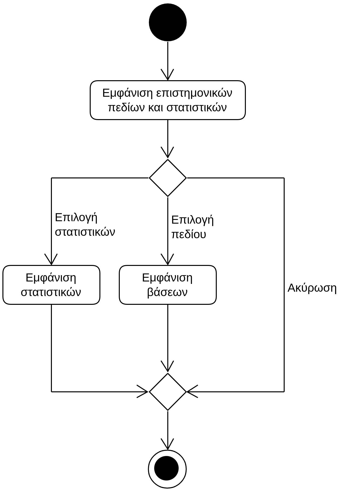

# ΠΧ9. Προβολή Βάσεων Εισαγωγής

**Πρωτεύων Actor**: Ενδιαφερόμενος  
**Ενδιαφερόμενοι**  
**Ενδιαφερόμενος**: Θέλει να μπορεί να δει τις βάσεις εισαγωγής των σχολών, καθώς και άλλα στατιστικά στοιχεία.

## Βασική Ροή
1. Η εφαρμογή εμφανίζει τα επιστημονικά πεδία των εξετάσεων και τα συνολικά στατιστικά.
2. Ο ενδιαφερόμενος επιλέγει το επιστημονικό πεδίο για το οποίο θέλει να δει τις βάσεις εισαγωγής.
3. Η εφαρμογή εμφανίζει με φθίνουσα σειρά (ως προς τη βαθμολογία) τα τμήματα και τη βάση εισαγωγής τους.

**Εναλλακτικές Ροές**

*2α. Ο ενδιαφερόμενος επιλέγει να δει τα συνολικά στατιστικά.*
1. Η εφαρμογή εμφανίζει τα συνολικά στατιστικά των εξετάσεων.

*2β. Ο υποψήφιος επιλέγει "Ακύρωση".*
1. Η ΠΧ τερματίζει.

## Διαγράμματα 
### Διάγραμμα Δραστηριότητας - Προβολή Βάσεων Εισαγωγής

